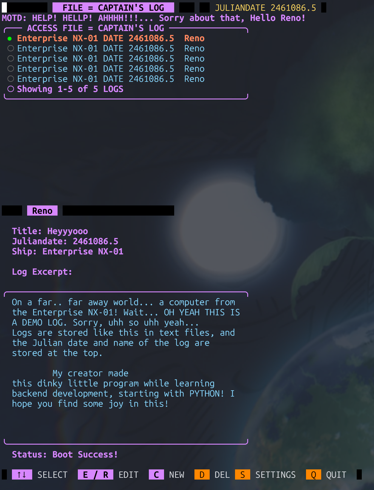
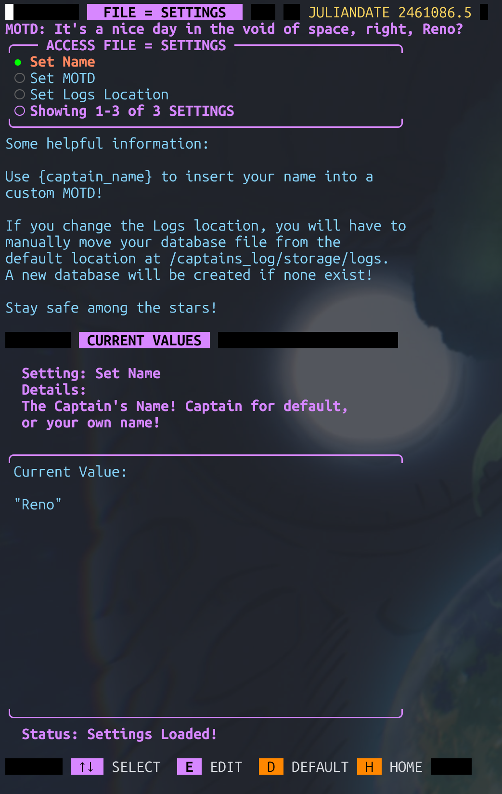

# Captains-Log
A place to write your Captain's Log in The Terminal. Directly Inspired By Star Trek

This is a note taking TUI program.

# Working State
I feel as if this project is in a good standing.

I put a lot of hours into it and, this is my first big personal project and am ready to move on!

Hopefully, everything works! I spent a LOT of time making sure to cover specific situations, etc.

Enjoy! 

## Installation

### UV: This project uses UV to manage python version and dependencies

1. Install UV with: https://docs.astral.sh/uv/getting-started/installation/

2. Install Git: https://git-scm.com/install/

3. Clone repo: ``git clone https://github.com/RenoMG/Captains-Log.git``

4. Enter Directory: ``cd Captains-Log``

5. Sync UV: ``uv sync``

6. Enter UV virtual environment: ``source .venv/bin/activate``

7. Run Program: ``uv run main.py``

## Details

#### Built and tested with Linux only in mind
I added some support for differing file system, etc. Just keep in mind that if something does not work in windows, it's because it was not built with Windows in mind!
  
#### MOTD name variable

For custom the MOTD message, use {captain_name} to have your name placed in the MOTD.

#### Config and storage location

config.json will be created after the first boot, these settings can be changed in storage/config.json.

I recommend using the built in settings menu though to change these.

storage/logs/ will be created on first boot even if a custom logs storage location is selected, logs are stored
in an sqlite database.

#### About

- "Computer" is a Prototype computer that was made during the construction of the Enterprise NX-01!

- It's a bit slow... and can only record Captains logs... via text. But! Don't leave ol Computer here all alone!

- Sit down and write up some logs, even make a custom MOTD to inspire yourself!

- Locally stored terminal fun with a prototype Star Trek computer!

## Images

  
Show Image

  
  

  
Show Image

  
  

## The Future

As of when this readme had its last commit, I want to build and improve on this project.

I plan to add more features to it on the "Star Trek" computer side.

But as a "Note Taking" program, it will always be pretty basic, I think. Like, it will always use an external editor, unless I get the drive to try and make my own haha.